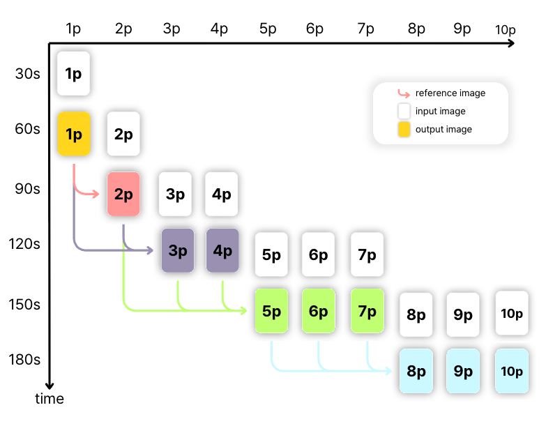
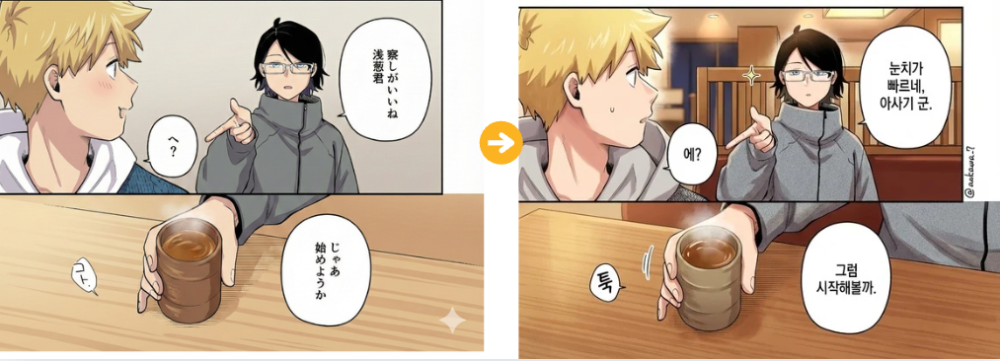
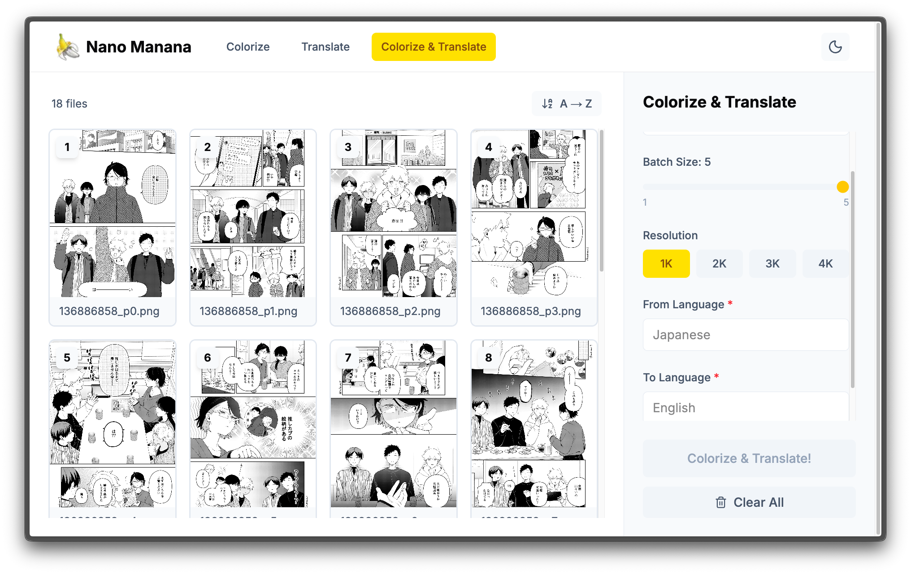
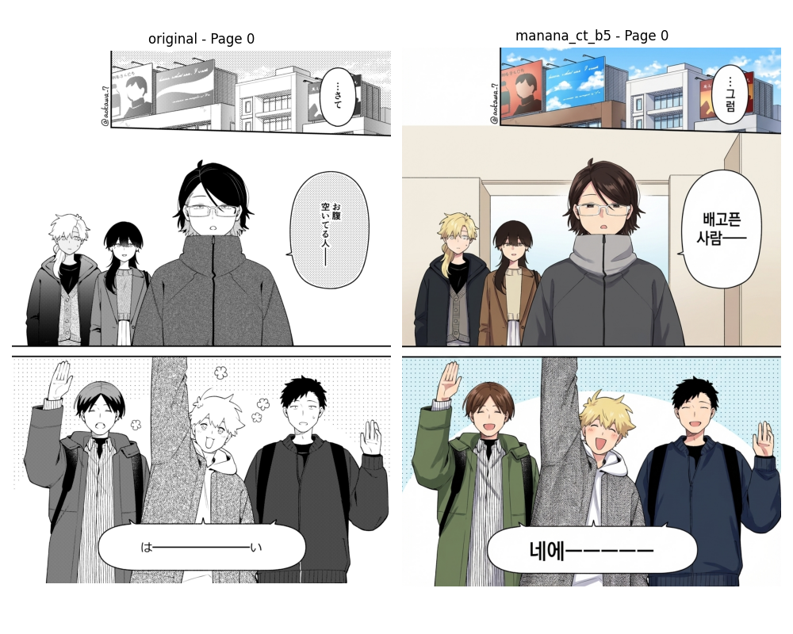
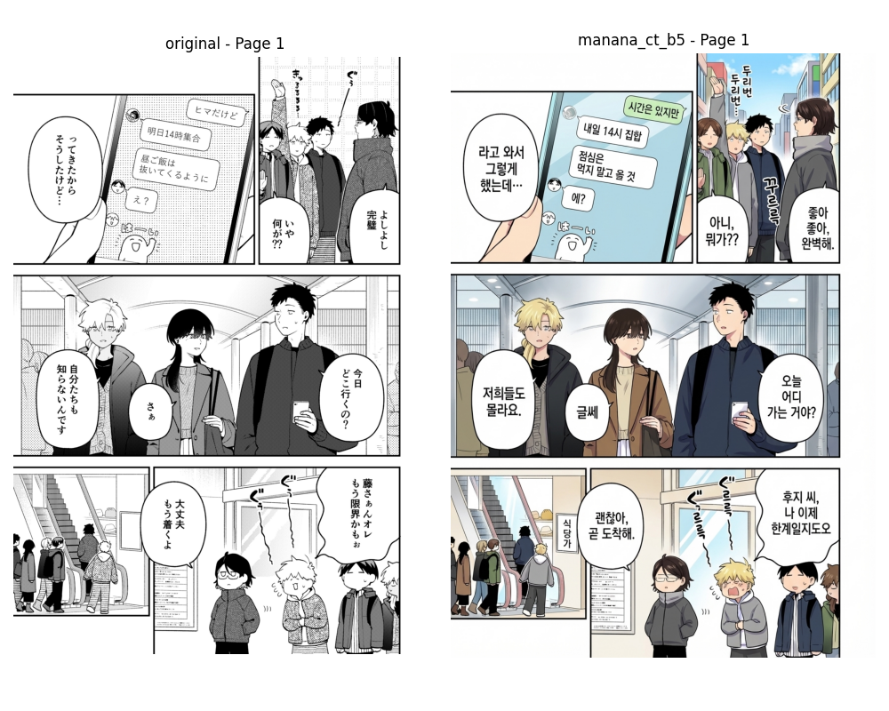
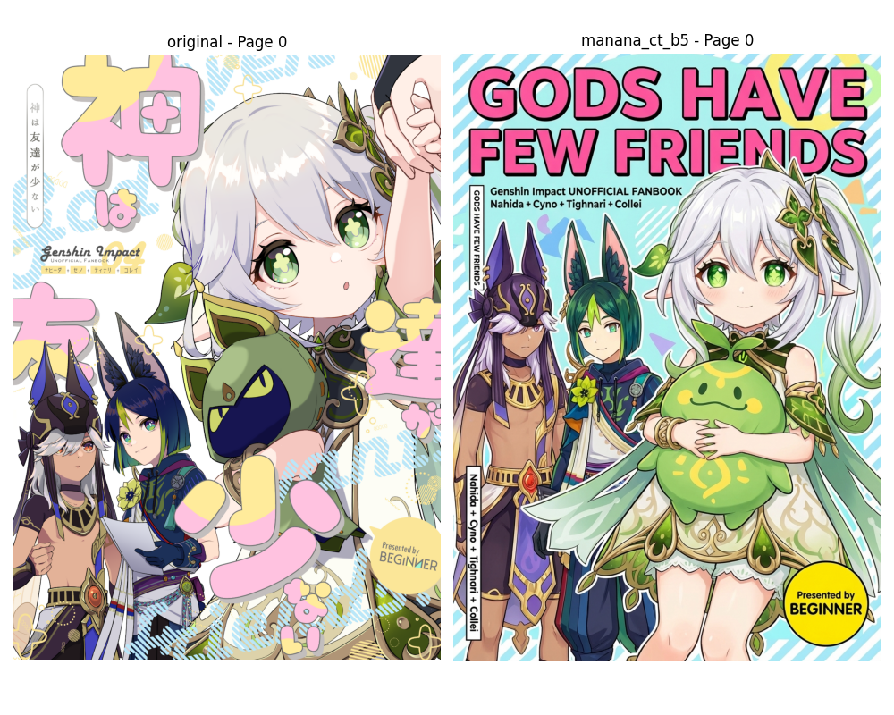
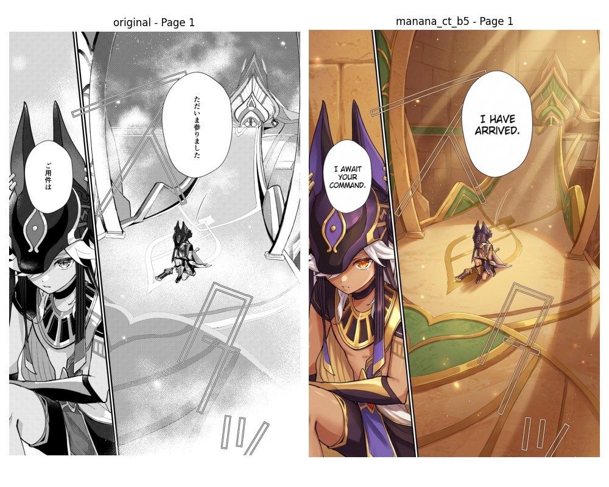

# Nano Manana 🎨

**Manga Colorization and Translation with Character & Background Consistency**

[](https://nano-manana.vercel.app)


## Overview

Nano Manana is an automated system for manga colorization and translation that maintains consistency of characters and backgrounds across entire pages. Built on Gemini Imagen 3, it addresses the key challenges in manga processing:

- **Colorization**: Transforms black-and-white manga into vibrant, professionally colored pages
- **Translation**: Translates text including speech balloons, onomatopoeia, and background text directly into the image
- **Consistency**: Maintains character appearance (eye color, hair color, skin tone, clothing) across multiple pages

## Key Features

### 🚀 Batch Processing
Achieves up to **10x speedup** for translation and **5x speedup** for colorization compared to sequential processing.



### 🎨 Enhanced Colorization
Professional-quality coloring with depth, shading, and highlights through optimized prompt engineering.



### 🌐 Bilingual Display
Supports displaying both original and translated text simultaneously for language learning or translation verification.


### 📱 Web Application
Easy-to-use web interface deployed at [nano-manana.vercel.app](https://nano-manana.vercel.app)



## Results

### Japanese → Korean Translation + Colorization

| Original | Colorized & Translated |
|:--------:|:----------------------:|
|  |  |

### Japanese → English Translation + Colorization

| Original | Colorized & Translated |
|:--------:|:----------------------:|
|  |  |

## Comparison with Related Work

| Feature | MangaDiT | MangaNinja | Nano Manana |
|---------|----------|------------|-------------|
| Reference Required | ✅ Yes | ✅ Yes | ❌ No |
| Multi-panel Support | ❌ No | ❌ No | ✅ Yes |
| Translation | ❌ No | ❌ No | ✅ Yes |
| Low VRAM Support | ❌ No | ⚠️ Limited | ✅ Yes (API) |
| Batch Processing | ❌ No | ❌ No | ✅ Yes |

## Architecture

### Translation Pipeline
```
Input Pages → Batch Processing → Parallel API Calls → Translated Pages
```

### Colorization Pipeline
```
Input Pages → Reference Selection → Batch API Calls (with prev. results) → Colorized Pages
```

The colorization pipeline uses previously completed pages as references to maintain consistency:
- `min(batchNumber, batchSize, completedCount)` references per batch
- Maximum 5 references due to API limitations

## Limitations

While Nano Manana achieves high-quality results in most cases, some limitations exist due to the underlying Gemini Imagen 3 model:

1. **Style Drift**: Occasionally generates completely different art styles
2. **Scene Generation**: May create scenes not present in the original
3. **Aspect Ratio**: Sometimes outputs different aspect ratios despite explicit instructions

These issues can be mitigated through a user-confirmation workflow with automatic regeneration.

## API Cost

| Metric | Average | Total (155 requests) |
|--------|---------|---------------------|
| Total Tokens | 2,542.30 | 279,653 |
| Total Cost | $0.14 | $15.77 |

## Tech Stack

- **Backend**: Gemini Imagen 3 API
- **Frontend**: Web application deployed on Vercel
- **Data Collection**: gallery-dl for pixiv

## Dataset

Experiments were conducted on two manga works from pixiv:
- 「合コンに行ったら女がいなかった話」 by 蒼川なな (18 pages, B&W)
- 「神は友達が少ない」 by ピノ/エス (15 pages, featuring Genshin Impact characters)

## References

- [MangaDiT](https://arxiv.org/abs/2508.09709) - Reference-Guided Line Art Colorization with Hierarchical Attention
- [MangaNinja](https://arxiv.org/abs/2501.08332) - Line Art Colorization with Precise Reference Following
- [Context-Informed Manga Translation](https://aclanthology.org/2025.coling-main.232/) - Machine Translation using Multimodal LLMs

## License

This project is for educational and research purposes.

## Acknowledgments

This project was developed as part of a Deep Learning course at Yonsei University (2025-2).

---

**Try it now**: [nano-manana.vercel.app](https://nano-manana.vercel.app)
